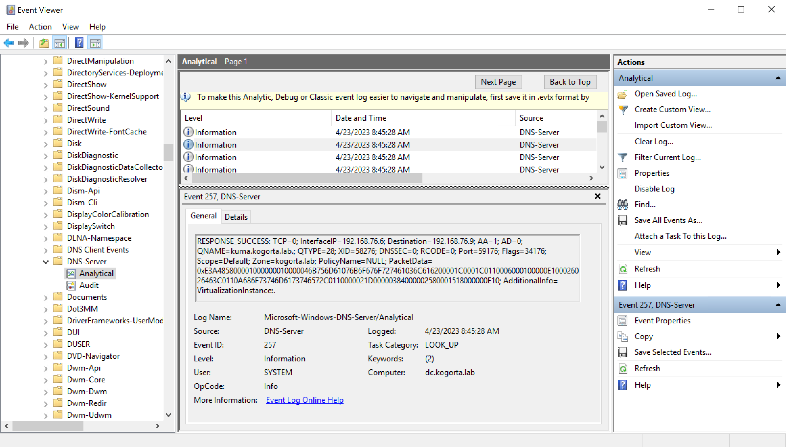
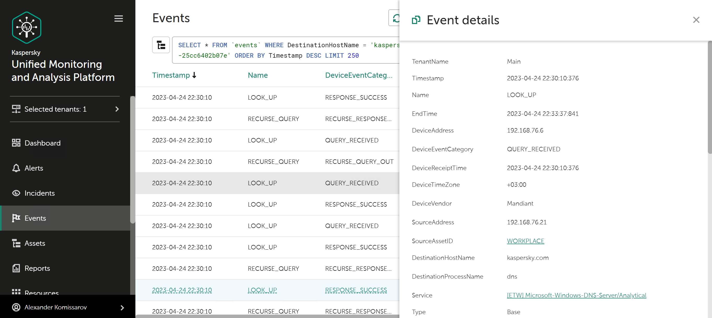

# Windows DNS Server logging overview

## DNS logging via ETW providers

Enhanced Windows DNS Event Log logging is available from Event Tracing for Windows providers. There are two event categories:
1. Windows DNS Server Audit Events
2. Windows DNS Server Analytical Events
The article discusses the steps and settings required for configuring the transmission of analytical events in a SIEM solution, including event forwarding and related configurations.

## File-based DNS debug logging
The commonly used method to obtain transaction information from a Windows DNS Server is by using the log file. The technical details will not be considered in this article.

# Windows DNS Server preparation

## Enable DNS audit and analytic logging
Follow the steps in the manual:
https://learn.microsoft.com/en-us/previous-versions/windows/it-pro/windows-server-2012-R2-and-2012/dn800669(v=ws.11)

## Check logging configuration
If the configuration is OK, then the ETL log analytics will be available in the Windows Event Viewer.

# Install Collector

## KUMA 2.1
In order to collect Windows DNS analytic events, you need to install an HTTP collector. This process is typically straightforward. The demo resources `[KUMARES][KMSSRV]ETW_DNS` , including collector configuration and normalizer, are available for testing and demonstration purposes. You will just need to add destinations: correlator, storage, etc.

**_NOTE:_**  KUMA resources password is Kmssrv!1

# Install SilkService
1. Download and extract the service executable files from https://github.com/mandiant/SilkETW/releases, for example, to the `C:\` directory.
2. Replace config file with SilkServiceConfig.xml.
3. Replace IP and port of KUMA with your own.
4. Install service
```
sc create SilkService binPath= "C:\SilkService\SilkService.exe" start=demand
```
5. Change startup options if needed and start the service.
6. Check log in `C:\SilkService\Logs\ServiceLog_*`
```
[+] SilkService started at: 4/24/2023 6:22:28 AM
[+] Collector ID: 8eb39099-118f-4a72-a2d0-05a961e11990; Parameter validation success
[*] Starting collector threads: 4/24/2023 6:22:28 AM
    [+] GUID:     8eb39099-118f-4a72-a2d0-05a961e11990
    [>] Type:     User
    [>] Provider: EB79061A-A566-4698-9119-3ED2807060E7
    [>] Out Type: url
[+] Collector ID: 8eb39099-118f-4a72-a2d0-05a961e11990; Starting trace collector
```

# Check events
## KUMA 2.1
Navigate to the collector events, and you will find analytical events from Windows DNS Server.

# Known issues
If the KUMA collector is stopped, the Silk service will also stop and will not auto-start after the KUMA collector is run.

# References
#### Collect logs from Windows DNS Server
https://docs.nxlog.co/userguide/integrate/dns-monitoring-windows.html#collecting-dns-server-analytical-logs
#### Using server debug logging options
https://learn.microsoft.com/en-us/previous-versions/windows/it-pro/windows-server-2003/cc776361(v=ws.10)
#### Select and enable debug logging options on the DNS server
https://learn.microsoft.com/en-us/previous-versions/windows/it-pro/windows-server-2003/cc759581(v=ws.10) 